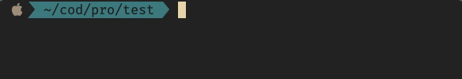

# progressbar

A very simple, header-only, fully customizable, progress bar (with percentage)
for c++ loops.

Very simple to set up:
```cpp
#include "progressbar.hpp"

int main() {
    progressbar bar(100);
    for (int i = 0; i < 100; ++i) {
        bar.update();
        // ... the program
    }
    return 0;
}
```


Allows customization:
```cpp
#include "progressbar.hpp"

int main() {
    progressbar bar(100);
    bar.set_todo_char(" ");
    bar.set_done_char("█");
    bar.set_opening_bracket_char("{");
    bar.set_closing_bracket_char("}");
    for (int i = 0; i < 100; ++i) {
        bar.update();
        // ... the program
    }
    return 0;
}
```


## Notes

To use the bar in parallelized loops call `progressbar::update` in a critical
section. With [OpenMP](http://www.openmp.org) this can be achieved with the
following structure:
```cpp
#pragma omp parallel for
for ( ... ) {
    #pragma omp critical
        bar.update();
}
```
